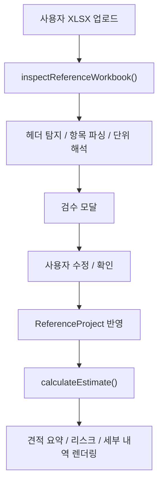

# SOFC Estimate Studio

SOFC EPC 견적산출 내부 검토용 도구입니다. **견적산출 기능만 운영합니다.**

## 핵심 원칙

### 1. 결정론적 계산

견적산출은 LLM 응답이나 외부 서비스에 의존하지 않습니다.

- 견적산출 엔진: `lib/estimator.ts`
- 참조 워크북 파싱/검수: `lib/excel-import.ts`

동일한 참조 워크북과 동일한 입력값을 넣으면 항상 같은 결과가 나옵니다.

### 2. 비정형 문서 자동 반영 금지

PDF, Word 같은 비정형 문서를 자동 해석해 금액에 반영하지 않습니다.

- 사용자가 확정한 구조화 입력만 계산에 사용

### 3. 엑셀 데이터 외부 전송 없음

엑셀 업로드와 계산은 브라우저 메모리에서만 처리합니다.

- 외부 AI API 호출 없음
- 외부 DB 저장 없음
- 외부 로그/분석 전송 없음
- `localStorage` / `sessionStorage` / `indexedDB` 미사용
- 새로고침 시 업로드 자료와 계산 결과 자동 초기화

## 보안 및 데이터 처리

### 엑셀 업로드 처리 방식

```
사용자 XLSX 선택
  → 브라우저 메모리에서 파싱 (lib/excel-import.ts)
  → 검수 모달 (사용자 확인)
  → 계산 엔진 처리 (lib/estimator.ts)
  → 화면 렌더링만
  → 세션 종료 시 자동 소멸
```

외부로 나가는 경로:
- 지도 미리보기: 브라우저가 외부 지도 URL 직접 임베드 (파일 내용 미포함)
- 리퍼러 차단: `referrer=no-referrer` 적용

### 내부 설득용 표현

> 본 프로그램은 업로드된 엑셀 파일을 브라우저 메모리에서만 파싱하며, 외부 AI, 외부 DB, 외부 로그 서버로 전송하지 않습니다. 브라우저 저장소에도 결과를 남기지 않도록 구성되어 있어 새로고침 시 업로드 자료와 계산 결과가 초기화됩니다.

### 운영 시 주의사항

앱 코드 기준으로는 외부 전송이 없지만, 아래는 별도 운영 정책으로 관리해야 합니다.

- 원본 엑셀 파일을 프로젝트 폴더에 직접 복사하지 않기
- 엑셀 파일을 Git으로 직접 커밋하지 않기
- 내부 검토 시 시크릿 모드 사용 권장 (확장 프로그램 차단)
- 민감 검토 후 브라우저 프로세스 완전 종료 권장

### GitHub와의 관계

엑셀 파일을 업로드/계산하는 것만으로는 GitHub에 올라가지 않습니다.

GitHub에 올라가는 조건:
1. 해당 파일을 프로젝트 폴더에 직접 저장
2. `git add → commit → push` 를 직접 실행

즉, 단순 사용만으로는 엑셀 자료가 GitHub에 남지 않습니다.

## 페이지 구성

| 경로 | 목적 | 주요 컴포넌트 |
| --- | --- | --- |
| `/estimate` | 기준 프로젝트 기반 견적산출 | `EstimateStudio` |

## 데이터 흐름



## 주요 파일 역할

### 진입

- `app/layout.tsx` — 공통 레이아웃, Pretendard 폰트, 헤더
- `app/globals.css` — 전체 디자인 시스템

### 견적산출

- `app/estimate/page.tsx` — 견적산출 페이지
- `components/estimate-studio.tsx` — 메인 UI, 엑셀 업로드, 검수 모달
- `components/estimate-analytics.tsx` — Monte Carlo, 벤치마크, 이력 비교
- `lib/excel-import.ts` — 워크북 파싱, 헤더 탐지, 검수 경고
- `lib/estimator.ts` — 용량 비례 환산, 물가상승, 마진, 하자보수

### 공통 UI

- `components/site-header.tsx` — 상단 네비게이션
- `components/display-config.tsx` — 폰트 크기 / 대비 설정 (세션 메모리만)

## 실행

```bash
npm install
npm run dev -- -p 3001
```

접속: `http://localhost:3001/estimate`

## 운영 문서

- `specs/README.md`
- `specs/cost-db-rules.md`
- `specs/reference-workbook-inspection.md`
- `specs/estimate-calculation-rules.md`
- `specs/change-checklist.md`
